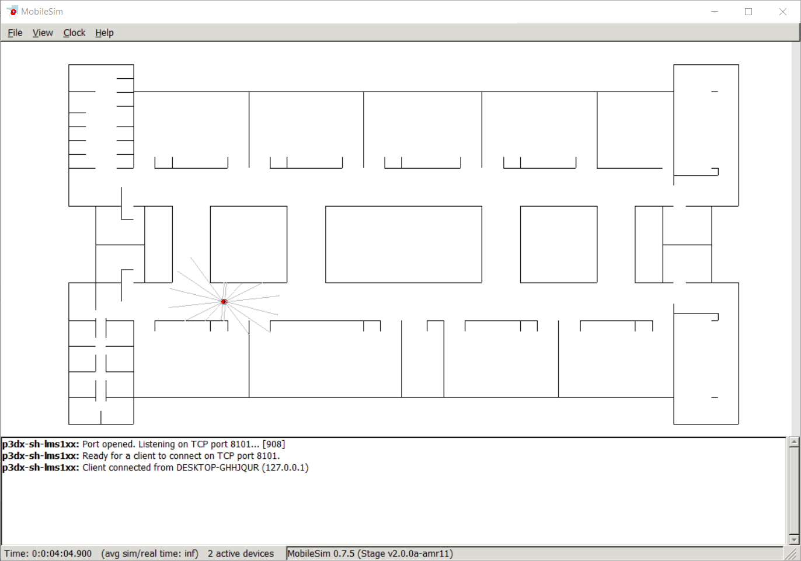

AriaJava P3DX
=============

Descripción
-----------
Algoritmos de navegación para robot Pioneer P3DX usando la Librería ARIA http://robots.mobilerobots.com/wiki/ARIA y el API Java.

- Copyright: 2014 Saúl Piña <sauljabin@gmail.com>, Jorge Parra <thejorgemylio@gmail.com>
- Repository: https://github.com/sauljabin/ariajava-p3dx
- License: MIT
- Language: Java
- Windows (Recomendado)

Documentación
-------------
[Informe](documents/informe/articulo.pdf)

Instalación Windows (Recomendada)
---------------------------------

Instalar [ARIA 2.9.3](http://robots.mobilerobots.com/wiki/ARIA) y [MobileSim 0.7.5](http://robots.mobilerobots.com/wiki/MobileSim).

Configurar las variables de entorno:

```
C:\Program Files\MobileRobots\Aria\bin64
```

Configurar `build.gradle` usando `dirs "C:/Program Files/MobileRobots/Aria/java"` en la especificación de repositorios.

Instalación Ubuntu (Inestable)
------------------------------

Instalar [ARIA 2.9.3](http://robots.mobilerobots.com/wiki/ARIA), [ARIA Java 2.9.3](http://robots.mobilerobots.com/wiki/ARIA) y [MobileSim 0.7.5](http://robots.mobilerobots.com/wiki/MobileSim).

Configurar las variables de entorno:

```
export ARIA_PATH=/usr/local/Aria
export LD_LIBRARY_PATH=/lib:/usr/lib:/usr/local/lib:$ARIA_PATH/lib
```

Configurar `build.gradle` usando `dirs "/usr/local/Aria/java"` en la especificación de repositorios.

Iniciar Aplicación
------------------

Abrir MobileSim con el mapa `documents/maps/PlantaAltaModuloK.map`,
ejecutar la aplicación con `./gradlew -q run` y conectar.

Screenshots
------------





